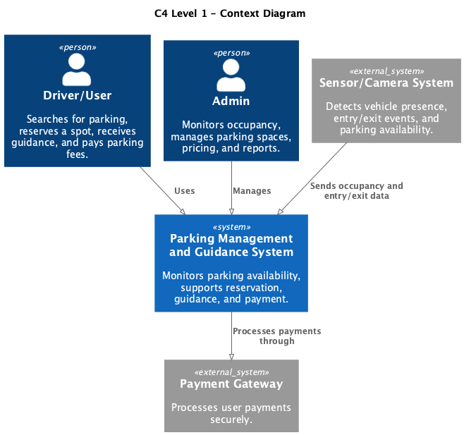
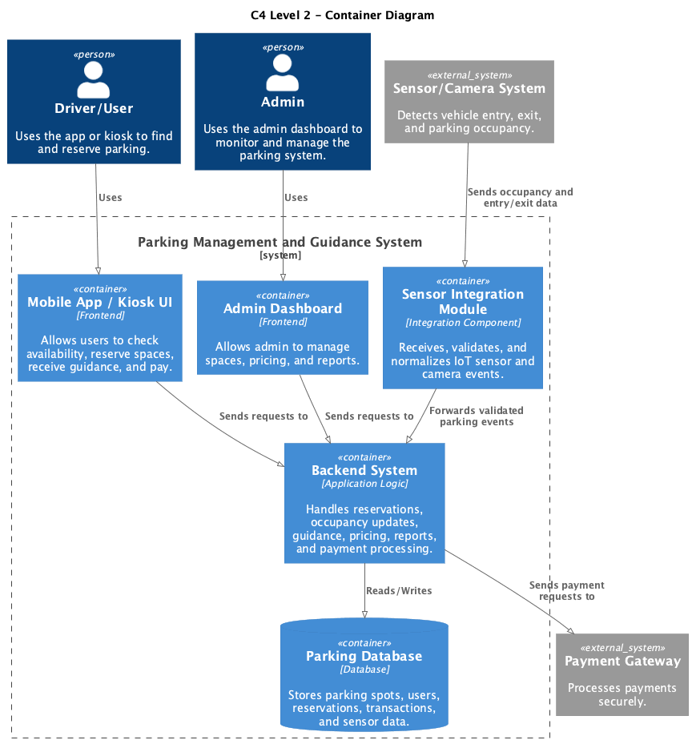
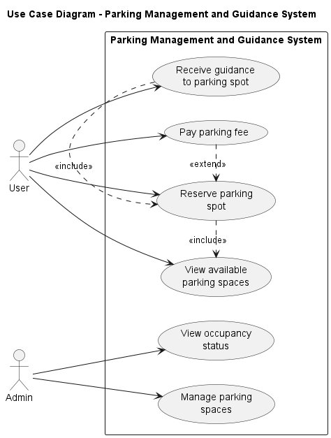
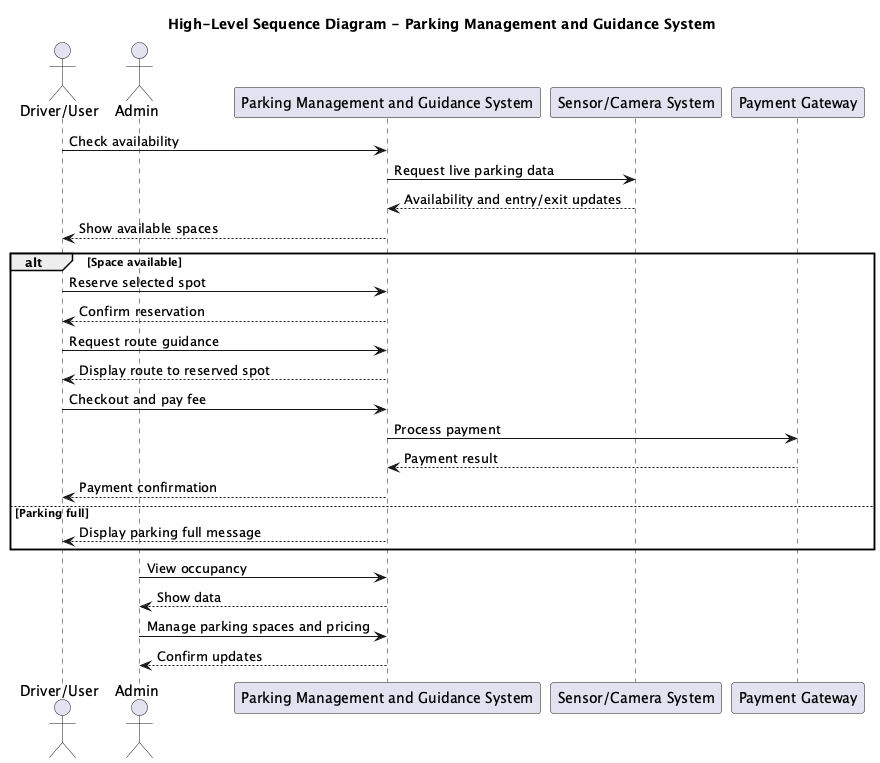
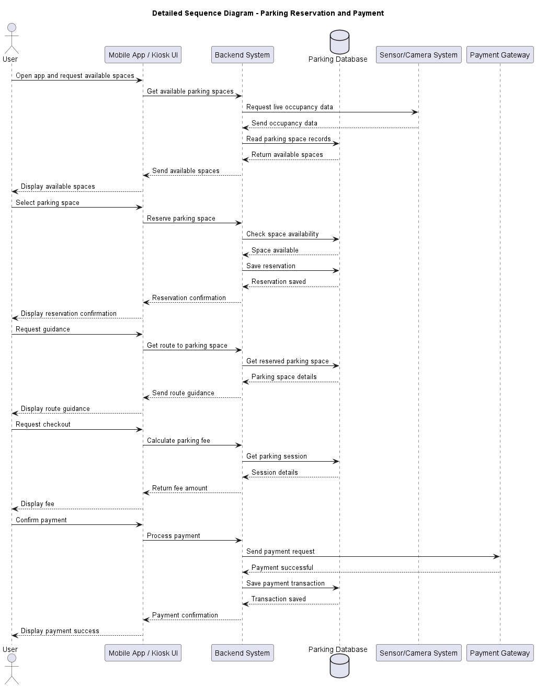
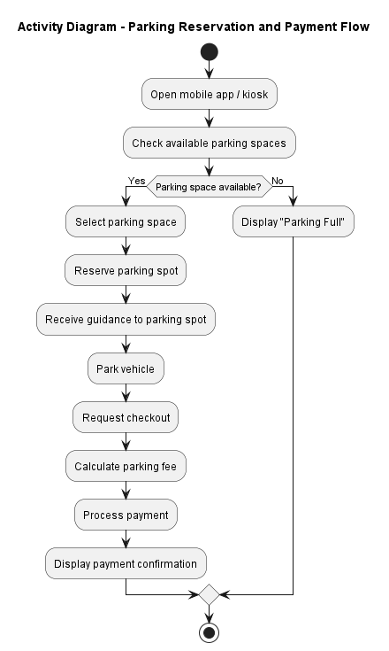

# Parking Management and Guidance System

## 1. System Description
The Parking Management and Guidance System is a smart parking solution designed to monitor parking lot availability, support reservations, guide drivers to available spaces, and process parking payments efficiently.

The system serves two main types of users: drivers and administrators. Drivers can check available parking spaces, reserve a spot, receive guidance, and complete payment. Administrators can manage parking spaces, monitor occupancy, adjust pricing policies, and generate reports.

The system also interacts with external components such as the sensor/camera system for occupancy detection and the payment gateway for secure payment processing.

---

## 2. C4 Level 1 – Context Diagram

**Explanation:**  
The C4 Level 1 Context Diagram shows the overall relationship between the Parking Management and Guidance System and its external actors and systems. The main actors are the Driver/User and the Admin. External systems include the Sensor/Camera System, which sends parking occupancy data, and the Payment Gateway, which processes user payments.

---

## 3. C4 Level 2 – Container Diagram

**Explanation:**  
The C4 Level 2 Container Diagram presents the internal structure of the system. It includes the Mobile App / Kiosk UI for drivers, the Admin Dashboard for administrators, the Backend System for core application logic, and the Parking Database for storing parking spaces, reservations, users, transactions, and sensor data. The backend communicates with both the sensor/camera system and the payment gateway.

---

## 4. Use Case Diagram

**Explanation:**  
The use case diagram shows the main interactions between the users of the Parking Management and Guidance System and the core system functions. The user can view available spaces, reserve a parking spot, receive guidance, and pay parking fees. The admin can monitor parking occupancy and manage parking spaces.

---

## 5. Use Case Descriptions

### UC-01: View Available Parking Spaces

| Field | Description |
|------|------------|
| Use Case ID | UC-01 |
| Use Case Name | View Available Parking Spaces |
| Primary Actor | Driver/User |
| Description | The user checks available parking spaces using the system. |
| Preconditions | System is running and data is available. |
| Postconditions | Available spaces are displayed. |
| Main Flow | 1. User opens app. 2. System retrieves data. 3. System displays spaces. |
| Alternative Flow | If no spaces are available, the system shows “Parking Full”. |

---

### UC-02: Reserve Parking Spot

| Field | Description |
|------|------------|
| Use Case ID | UC-02 |
| Use Case Name | Reserve Parking Spot |
| Primary Actor | Driver/User |
| Description | The user reserves an available parking space. |
| Preconditions | User is logged in and a space is available. |
| Postconditions | Spot is reserved. |
| Main Flow | 1. User selects a space. 2. System checks availability. 3. Reservation is confirmed. |
| Alternative Flow | If the space is unavailable, the user chooses another spot. |

---

### UC-03: Receive Guidance

| Field | Description |
|------|------------|
| Use Case ID | UC-03 |
| Use Case Name | Receive Guidance |
| Primary Actor | Driver/User |
| Description | The system guides the user to the parking spot. |
| Preconditions | Spot is reserved. |
| Postconditions | User receives directions. |
| Main Flow | 1. User requests guidance. 2. System calculates route. 3. Directions are displayed. |
| Alternative Flow | If the spot is no longer available, the system assigns a new one. |

---

### UC-04: Pay Parking Fee

| Field | Description |
|------|------------|
| Use Case ID | UC-04 |
| Use Case Name | Pay Parking Fee |
| Primary Actor | Driver/User |
| Supporting Actor | Payment Gateway |
| Description | The user pays the parking fee. |
| Preconditions | Parking session is completed. |
| Postconditions | Payment is recorded. |
| Main Flow | 1. User requests payment. 2. System calculates fee. 3. Payment is processed. |
| Alternative Flow | If payment fails, the user retries. |

---

### UC-05: Detect Entry/Exit

| Field | Description |
|------|------------|
| Use Case ID | UC-05 |
| Use Case Name | Detect Entry/Exit |
| Primary Actor | Camera System |
| Description | The system detects vehicles entering or exiting. |
| Preconditions | Camera system is active. |
| Postconditions | Entry or exit is recorded. |
| Main Flow | 1. Vehicle is detected. 2. Data is sent to the system. 3. System updates the record. |
| Alternative Flow | If plate recognition fails, the event is flagged for manual checking. |

---

### UC-06: Update Parking Availability

| Field | Description |
|------|------------|
| Use Case ID | UC-06 |
| Use Case Name | Update Parking Availability |
| Primary Actor | Sensor System |
| Description | The system updates parking space status. |
| Preconditions | Sensors are working. |
| Postconditions | Availability is updated. |
| Main Flow | 1. Sensor detects change. 2. Sensor sends data. 3. System updates space status. |
| Alternative Flow | If a sensor fails, the system uses a fallback method or manual review. |

---

### UC-07: Manage Parking Spaces

| Field | Description |
|------|------------|
| Use Case ID | UC-07 |
| Use Case Name | Manage Parking Spaces |
| Primary Actor | Admin |
| Description | The admin manages parking spaces. |
| Preconditions | Admin is logged in. |
| Postconditions | Parking data is updated. |
| Main Flow | 1. Admin edits parking data. 2. System validates input. 3. Changes are saved. |
| Alternative Flow | If input is invalid, the system shows an error. |

---

### UC-08: Manage Pricing

| Field | Description |
|------|------------|
| Use Case ID | UC-08 |
| Use Case Name | Manage Pricing |
| Primary Actor | Admin |
| Description | The admin sets pricing rules. |
| Preconditions | Admin is logged in. |
| Postconditions | Pricing is updated. |
| Main Flow | 1. Admin enters pricing details. 2. System saves the rules. |
| Alternative Flow | If there is a conflict, the system requests revision. |

---

### UC-09: View Occupancy

| Field | Description |
|------|------------|
| Use Case ID | UC-09 |
| Use Case Name | View Occupancy |
| Primary Actor | Admin |
| Description | The admin views parking usage and occupancy. |
| Preconditions | Data is available. |
| Postconditions | Occupancy information is displayed. |
| Main Flow | 1. Admin opens dashboard. 2. System shows occupancy data. |
| Alternative Flow | If data is unavailable, the system shows an error. |

---

### UC-10: Generate Reports

| Field | Description |
|------|------------|
| Use Case ID | UC-10 |
| Use Case Name | Generate Reports |
| Primary Actor | Admin |
| Description | The admin generates reports. |
| Preconditions | Admin is logged in. |
| Postconditions | Report is generated. |
| Main Flow | 1. Admin selects a report. 2. System generates it. 3. Report is displayed or exported. |
| Alternative Flow | If there is no data, the system generates an empty report message. |

---

## 6. High-Level Sequence Diagram

**Explanation:**  
The high-level sequence diagram shows the main flow between the user, system, sensor system, payment gateway, and admin. It covers checking availability, reserving a parking space, payment processing, and occupancy viewing.

---

## 7. Detailed Sequence Diagram

**Explanation:**  
The detailed sequence diagram shows the internal interaction between the user interface, backend system, database, sensor or camera system, and payment gateway. It explains how the system retrieves available spaces, processes reservations, provides guidance, calculates fees, and completes payment.

---

## 8. Activity Diagram

**Explanation:**  
The activity diagram shows the workflow of the parking process. It starts with opening the app or kiosk, checking available spaces, selecting and reserving a parking space, receiving guidance, parking, requesting checkout, calculating the fee, and processing payment. If no parking space is available, the system informs the user that the parking lot is full.