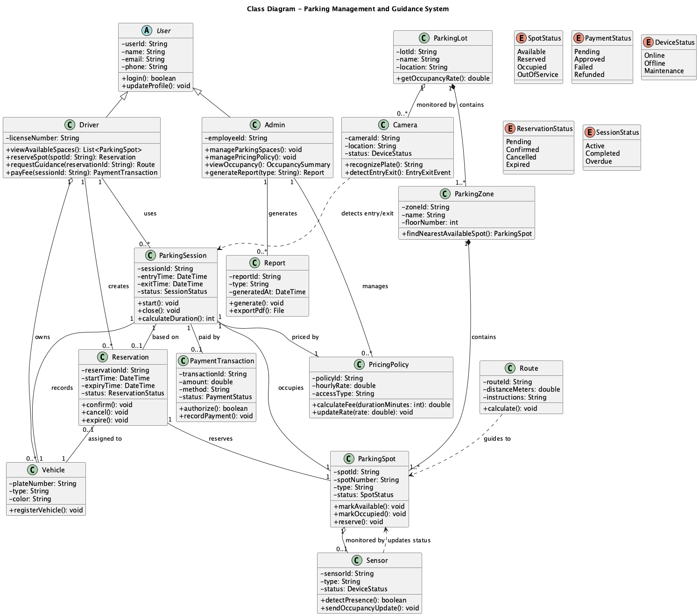
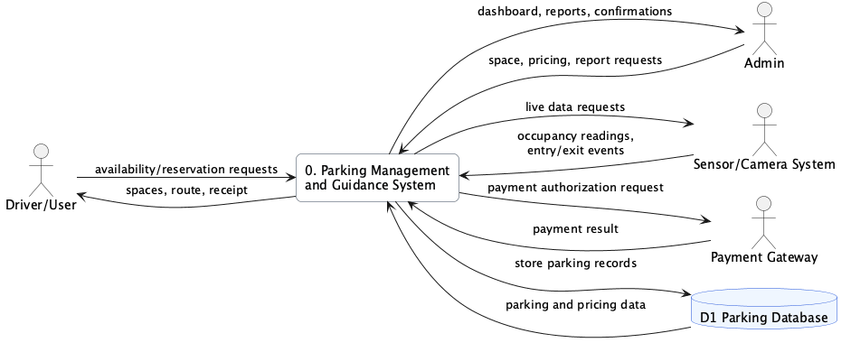

# Software Engineering Project - Group #5

## 1. Group Info

- **Group Number:** 5
- **Case Study:** Parking Management and Guidance System
- **Members:**
  - Maryam Abualia - 20210937
  - Joud Quteifan - 20221073
  - Ali Ziadeh - 20210870
  - Zaid Alsaleh - 20220126
- **Course:** Software Engineering
- **Instructor:** Dr. Samer Elkababji

## 2. Overview

The Parking Management and Guidance System is an embedded and database-driven system that monitors parking occupancy, guides drivers to available spaces, supports reservations, and manages parking payments in real time. It integrates user interfaces, IoT sensors, cameras, a central database, and an external payment gateway.

**Tools used:** Visual Studio Code, PlantUML, Draw.io, GitHub, Markdown, PDF generation tools.

## 3. Diagrams

- **C4 Level 1 - Context Diagram:** Shows the system boundary and the main external actors, including drivers, admins, sensors/cameras, and the payment gateway.
- **C4 Level 2 - Container Diagram:** Shows the main internal containers: user interface, admin dashboard, backend services, integration layer, and database.
- **Use Case Diagram:** Shows the functional services provided to drivers, admins, sensors/cameras, and the payment gateway.
- **High-Level Sequence Diagram:** Shows stakeholder-level flow for checking availability, reserving a spot, receiving guidance, paying, and viewing occupancy.
- **Detailed Sequence Diagram:** Shows developer-level component interactions between the UI, backend, database, sensor/camera system, and payment gateway.
- **Class Diagram:** Shows main system classes with attributes, operations, inheritance, associations, aggregation, and composition.
- **Activity Diagram with Swimlanes:** Shows the parking workflow across the driver, parking system, sensor/camera system, and payment gateway.
- **DFD Level 0:** Shows the data-driven behavior of availability, reservation, payment, occupancy, pricing, and reporting processes.

## 4. Repo Structure

```text
software-engineering/
├── docs/
│   ├── report.md
│   ├── report.pdf
│   ├── se_report_group_05.pdf
│   └── images/
│       ├── c4_context.png
│       ├── c4_container.png
│       ├── use_case_diagram.png
│       ├── sequence_high_level.png
│       ├── sequence_detailed.png
│       ├── class_diagram.png
│       ├── activity_diagram.png
│       └── dfd_level_0.png
├── uml/
│   ├── c4_context.puml
│   ├── c4_container.puml
│   ├── use_case_diagram.puml
│   ├── sequence_high_level.puml
│   ├── sequence_detailed.puml
│   ├── class_diagram.puml
│   ├── activity_diagram.puml
│   └── dfd_level_0.puml
└── README.md
```

## 5. Contributions

- **Maryam Abualia:** Initial repository setup, project structure, README, report sections, use case descriptions, and diagram organization. **Commits:** 9
- **Joud Quteifan:** Reviewed and contributed to final project content. **Commits:** 1
- **Ali Ziadeh:** Reviewed and contributed to final project content. **Commits:** 1
- **Zaid Alsaleh:** Added member information, completed missing deliverables, updated diagrams, finalized report, and prepared final PDF. **Commits:** 2

<div style="page-break-after: always;"></div>

# Parking Management and Guidance System Report

## 1. System Description

The Parking Management and Guidance System is designed for environments such as campuses, shopping malls, airports, and city centers where parking demand changes continuously. The system combines embedded devices and software services to collect real-time parking data, store operational records, guide users to available spaces, support reservations, and process parking payments.

The primary user is the driver. A driver can open a mobile app or kiosk, view available spaces, reserve a spot, receive route guidance, park the vehicle, check out, and pay the parking fee. The administrator manages the parking lot configuration, updates pricing or access policies, monitors occupancy, and generates reports for operational decisions.

The system also depends on external and embedded components. Sensors detect whether individual parking spaces are available or occupied. Cameras detect vehicle entry and exit events and may support license plate recognition. A payment gateway authorizes payments and returns payment results. The central database stores users, vehicles, parking spots, reservations, sessions, transactions, pricing policies, and sensor data.

## 2. Assumptions

- The system supports both mobile app and kiosk access for drivers.
- Sensors are installed at parking spots or zones and cameras are installed at entry/exit points.
- The backend validates sensor and camera updates before saving them.
- A reservation creates or prepares a parking session that is completed during checkout.
- Payment processing is handled by an external secure payment gateway.
- Administrators are authenticated before they manage parking spaces, pricing, or reports.

## 3. C4 Level 1 - Context Diagram


**Explanation:** The C4 Level 1 Context Diagram shows the Parking Management and Guidance System as one software system surrounded by its users and external systems. Drivers use it to find, reserve, navigate to, and pay for parking. Admins use it to manage operational settings and reports. Sensors and cameras provide real-time occupancy and entry/exit events, while the payment gateway processes payment transactions.

## 4. C4 Level 2 - Container Diagram


**Explanation:** The C4 Level 2 Container Diagram breaks the system into major containers. The Mobile App / Kiosk UI serves drivers. The Admin Dashboard serves administrators. The Backend System contains reservation, guidance, payment, reporting, and pricing logic. The Sensor Integration Module validates and normalizes IoT and camera events before sending them to the backend. The Parking Database stores persistent operational data.

## 5. Use Case Diagram


**Explanation:** The use case diagram shows the main functional requirements. Drivers can view spaces, reserve spots, receive guidance, pay fees, and participate in entry/exit detection. Sensors and cameras update availability and entry/exit events. Admins manage spaces, pricing, occupancy monitoring, and report generation. The payment gateway supports the fee payment use case.

## 6. Use Case Descriptions

### UC-01: View Available Parking Spaces

| Field | Description |
|---|---|
| Use Case ID | UC-01 |
| Use Case Name | View Available Parking Spaces |
| Primary Actor | Driver/User |
| Description | The user checks available parking spaces through the mobile app or kiosk. |
| Preconditions | The system is online and parking data is available. |
| Postconditions | Available spaces are displayed to the user. |
| Main Flow | 1. User opens the app or kiosk. 2. User requests availability. 3. System retrieves live and stored parking data. 4. System displays available spaces. |
| Alternative Flow | If no spaces are available, the system displays "Parking Full". |

### UC-02: Reserve Parking Spot

| Field | Description |
|---|---|
| Use Case ID | UC-02 |
| Use Case Name | Reserve Parking Spot |
| Primary Actor | Driver/User |
| Description | The user reserves an available parking space. |
| Preconditions | User is logged in and at least one space is available. |
| Postconditions | A reservation is saved and the selected space is marked reserved. |
| Main Flow | 1. User selects a space. 2. System checks latest availability. 3. System saves reservation. 4. System confirms reservation. |
| Alternative Flow | If the selected space becomes unavailable, the system asks the user to choose another space. |

### UC-03: Receive Route Guidance

| Field | Description |
|---|---|
| Use Case ID | UC-03 |
| Use Case Name | Receive Route Guidance |
| Primary Actor | Driver/User |
| Description | The system guides the user to the reserved or selected parking spot. |
| Preconditions | A spot is reserved or selected. |
| Postconditions | Route instructions are displayed. |
| Main Flow | 1. User requests guidance. 2. System retrieves spot location. 3. System calculates route. 4. UI displays route guidance. |
| Alternative Flow | If the spot is no longer available, the system assigns another suitable spot. |

### UC-04: Pay Parking Fee

| Field | Description |
|---|---|
| Use Case ID | UC-04 |
| Use Case Name | Pay Parking Fee |
| Primary Actor | Driver/User |
| Supporting Actor | Payment Gateway |
| Description | The user pays the parking fee at checkout. |
| Preconditions | Parking session exists and the fee is calculated. |
| Postconditions | Payment transaction is recorded and the session is closed if payment succeeds. |
| Main Flow | 1. User requests checkout. 2. System calculates fee. 3. User confirms payment. 4. Payment gateway processes payment. 5. System records transaction and shows receipt. |
| Alternative Flow | If payment fails, the user is asked to retry or use another method. |

### UC-05: Detect Vehicle Entry/Exit

| Field | Description |
|---|---|
| Use Case ID | UC-05 |
| Use Case Name | Detect Vehicle Entry/Exit |
| Primary Actor | Camera System |
| Description | Cameras detect vehicles entering or exiting the parking lot. |
| Preconditions | Camera system is active. |
| Postconditions | Entry or exit event is recorded. |
| Main Flow | 1. Vehicle is detected. 2. Camera sends plate/event data. 3. System validates event. 4. System updates parking session. |
| Alternative Flow | If plate recognition fails, the event is flagged for manual review. |

### UC-06: Update Parking Availability

| Field | Description |
|---|---|
| Use Case ID | UC-06 |
| Use Case Name | Update Parking Availability |
| Primary Actor | Sensor System |
| Description | Sensors update parking spot status based on detected occupancy. |
| Preconditions | Sensors are online and connected. |
| Postconditions | Parking availability is updated in the database. |
| Main Flow | 1. Sensor detects occupancy change. 2. Sensor sends update. 3. Integration module validates data. 4. Backend updates spot status. |
| Alternative Flow | If a sensor fails, the system uses camera data or marks the spot for manual inspection. |

### UC-07: Manage Parking Spaces

| Field | Description |
|---|---|
| Use Case ID | UC-07 |
| Use Case Name | Manage Parking Spaces |
| Primary Actor | Admin |
| Description | The admin creates, updates, or disables parking spaces and zones. |
| Preconditions | Admin is authenticated. |
| Postconditions | Parking configuration is updated. |
| Main Flow | 1. Admin opens dashboard. 2. Admin edits parking space data. 3. System validates input. 4. System saves changes. |
| Alternative Flow | If input is invalid, the system shows an error and rejects the change. |

### UC-08: Manage Pricing and Access Policies

| Field | Description |
|---|---|
| Use Case ID | UC-08 |
| Use Case Name | Manage Pricing and Access Policies |
| Primary Actor | Admin |
| Description | The admin updates hourly rates, access types, or special pricing rules. |
| Preconditions | Admin is authenticated. |
| Postconditions | New pricing or access rules are saved. |
| Main Flow | 1. Admin enters policy details. 2. System checks conflicts. 3. System saves policy. |
| Alternative Flow | If there is a policy conflict, the system asks the admin to revise it. |

### UC-09: View Occupancy Status

| Field | Description |
|---|---|
| Use Case ID | UC-09 |
| Use Case Name | View Occupancy Status |
| Primary Actor | Admin |
| Description | The admin views current parking usage and occupancy rates. |
| Preconditions | Occupancy data is available. |
| Postconditions | Occupancy dashboard is displayed. |
| Main Flow | 1. Admin opens dashboard. 2. System retrieves occupancy data. 3. System displays occupancy by lot, zone, and status. |
| Alternative Flow | If data is unavailable, the system shows an error and the latest known value. |

### UC-10: Generate Reports

| Field | Description |
|---|---|
| Use Case ID | UC-10 |
| Use Case Name | Generate Reports |
| Primary Actor | Admin |
| Description | The admin generates occupancy, revenue, reservation, or sensor reports. |
| Preconditions | Admin is authenticated and report data is available. |
| Postconditions | Report is displayed or exported. |
| Main Flow | 1. Admin selects report type. 2. System retrieves data. 3. System generates report. 4. Report is displayed or exported. |
| Alternative Flow | If there is no data, the system generates an empty report message. |

## 7. High-Level Sequence Diagram


**Explanation:** The high-level sequence diagram focuses on stakeholder interactions. It shows how a driver checks availability, reserves a spot, requests guidance, pays the parking fee, and receives confirmation. It also shows the admin viewing occupancy and managing spaces or pricing.

## 8. Detailed Sequence Diagram


**Explanation:** The detailed sequence diagram shows the internal flow between the UI, backend, database, sensor/camera system, and payment gateway. It includes validation of live occupancy data, reservation saving, route generation, fee calculation, payment success, payment failure, and the no-space-available alternative.

## 9. Class Diagram



**Explanation:** The class diagram models the main structural elements of the system. `Driver` and `Admin` inherit from `User`, satisfying the generalization requirement. `ParkingLot` is composed of `ParkingZone` objects, and each zone is composed of `ParkingSpot` objects. Sensors and cameras are associated with parking spots, parking lots, and sessions. Reservations, parking sessions, pricing policies, and payment transactions represent the core business records.

## 10. Activity Diagram with Swimlanes


**Explanation:** The activity diagram uses swimlanes to show responsibility across the Driver/User, Parking Management System, Sensor/Camera System, and Payment Gateway. It covers the complete workflow from availability search to reservation, guidance, parking, checkout, payment confirmation, and failure handling.

## 11. DFD Level 0



**Explanation:** Because the system is database-driven, the DFD Level 0 shows how data moves between external entities, the main parking management process, and the central parking database. It covers driver requests and responses, sensor/camera updates, admin commands and reports, payment authorization, and persistent parking records.

## 12. GitHub Repository Link

Repository: [https://github.com/mar20210937/software-engineering](https://github.com/mar20210937/software-engineering)
